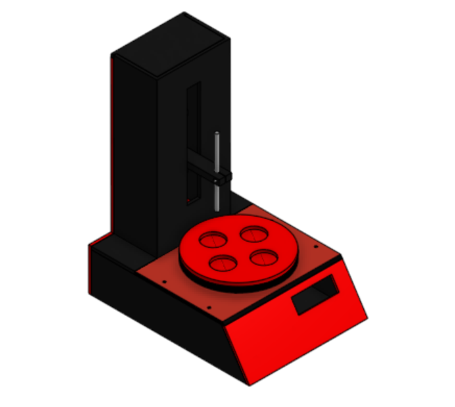

# 🌊 Deeppool

**Deeppool** es un proyecto integral de desarrollo de un sistema tipo *deep coater*, diseñado para automatizar procesos de recubrimiento por inmersión. El repositorio contiene todo el material relacionado con el diseño, simulación y control del prototipo.

## 📁 Contenido del repositorio

- `codigo/`: Código fuente del sistema de control (firmware, scripts, etc.)
- `cad/`: Archivos de diseño mecánico en formato CAD (SolidWorks, Fusion 360, STL, etc.)
- `simulacion/`: Archivos de simulación (dinámica, fluido, control, etc.)
- `documentacion/`: Diagramas, manuales, hojas de especificaciones y más.
- `imagenes/` *(opcional)*: Fotos o renders del proyecto.

## ⚙️ Tecnologías y herramientas utilizadas

- Microcontrolador: ATmega328P / Arduino Uno
- Diseño CAD: SolidWorks / Fusion 360
- Simulación: Proteus / MATLAB / Simulink
- Lenguaje de programación: C (AVR-GCC), Python (simulación de control)
- Controladores: Motores paso a paso, drivers L298N o similares
- Comunicación: USART (si aplica)

## 🚀 Objetivo del proyecto

Desarrollar un sistema automatizado de recubrimiento por inmersión controlado por microcontrolador, que permita ajustar parámetros como velocidad, tiempo de inmersión, y ciclos de recubrimiento, asegurando precisión y repetibilidad en aplicaciones industriales o de laboratorio.

## 🧠 Inspiración

El nombre **Deeppool** surge como una reinterpretación del término *deep coater*, reflejando tanto la profundidad del proceso físico como el enfoque técnico y de automatización del sistema.

## 📸 Capturas o renders

_

<!-- ## 📝 Cómo usar el proyecto

1. Clona el repositorio:
   ```bash
   git clone https://github.com/tu_usuario/deeppool.git -->
